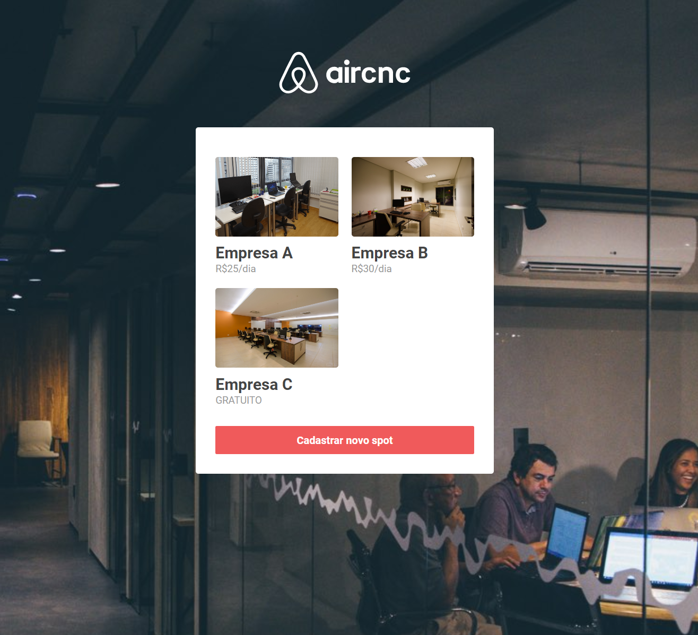
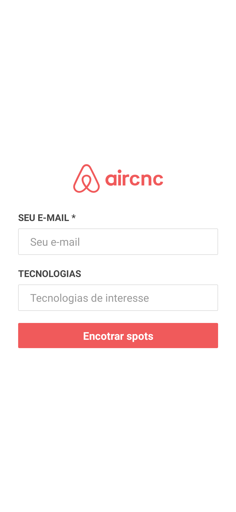
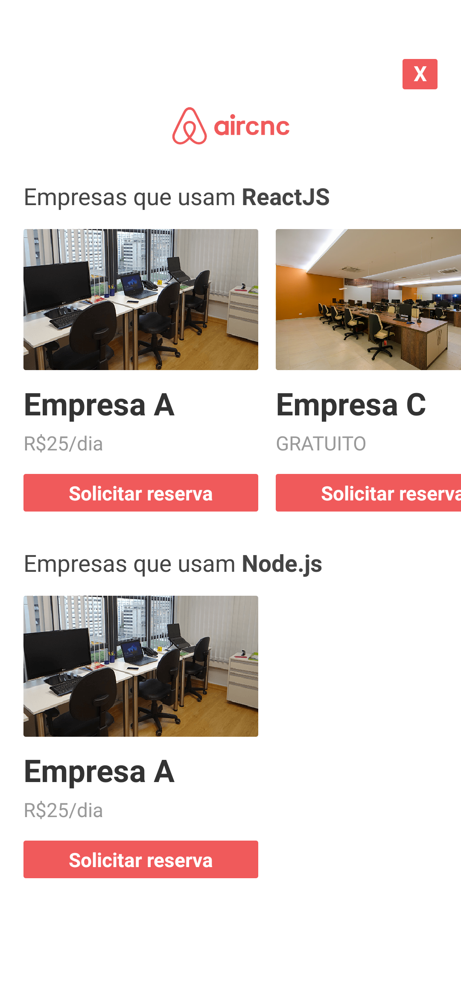

# Aircnc

> Este projeto é uma sistema de aluguel de spots para desenvolvedores nas empresas, desenvolvido com as tecnologias: Node.js + Socket.IO + ReactJS (Redux, Saga) + React Native (Expo).

## Site

O site foi desenvolvido para as empresas cadastrar seus spots com as tecnologias e o valor do ambiente por dia.

<p align="center">
    
</p>

## Aplicativo

O aplicativo foi desenvolvido para os desenvolvedores se cadastrar nos spots das empresas baseando-se nas tecnologias escolhidas.

<p align="center">
    
    
</p>

## Iniciar a aplicacão :checkered_flag:

A aplicação está dividida em três partes, sendo elas: Backend, Frontend e Mobile.

## Backend

Depois de efetuar o download da aplicação, acesse a pasta `backend` e execute o comando abaixo para efetuar o download das dependências:

```console
yarn
```

_Depois renomeie o arquivo `.env.example` para `.env` e configure as variáveis de ambiente._

Para rodar a aplicação esteja na pasta `backend` e execute o comando:

```console
yarn dev
```

---

## Frontend

Acesse a pasta `frontend` e execute o comando abaixo para efetuar o download das dependências:

```console
yarn
```

_Depois renomeie o arquivo `.env.example` para `.env` e configure as variáveis de ambiente._

Para rodar a aplicação esteja na pasta `frontend` e execute o comando:

```console
yarn start
```

Em seguida, será aberto o endereço [http://localhost:3000](http://localhost:3000) em seu navegador.

---

## Mobile

Acesse a pasta `mobile` e execute o comando abaixo para efetuar o download das dependências:

```console
yarn
```

_Depois renomeie o arquivo `.env.example` para `.env` e configure as variáveis de ambiente._

_No arquivo `package.json`, configure a variável `REACT_NATIVE_PACKAGER_HOSTNAME` com o ip da maquina._

Para rodar a aplicação esteja na pasta `mobile` e execute o comando:

```console
yarn start
```

Em seguida, será aberto o endereço [http://localhost:19002](http://localhost:19002) em seu navegador.
